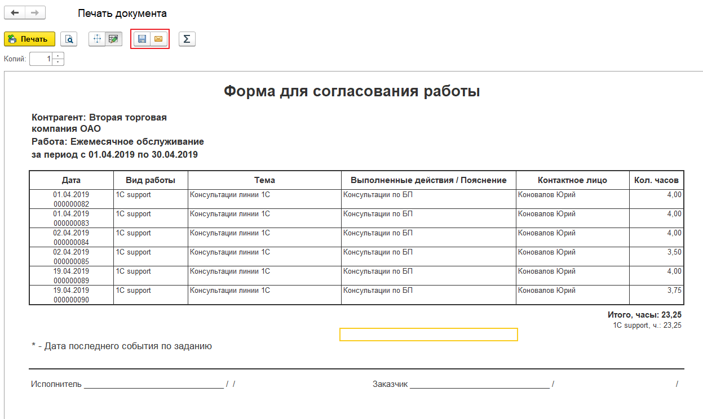

# Договор с клиентом

При создании контрагента основной договор формируется автоматически.


Договоры - штатный функционал основной конфигурации 1С. Рассматриваем на примере конфигурации 1С: Управление нашей фирмой 1.6


Заполните необходимые данные в договоре.

